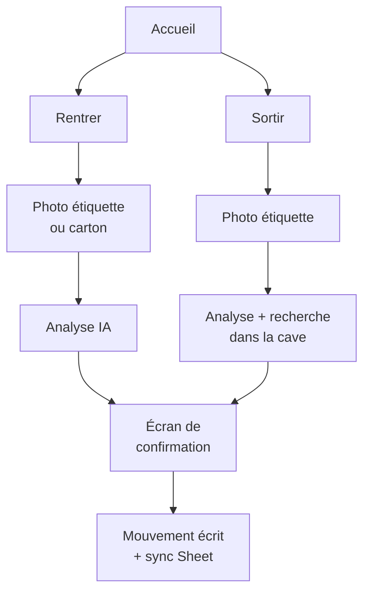
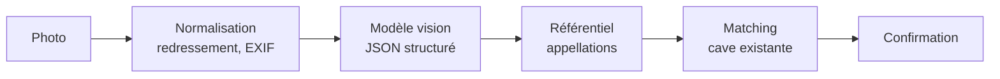
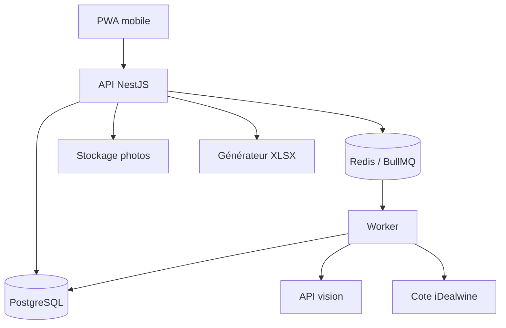
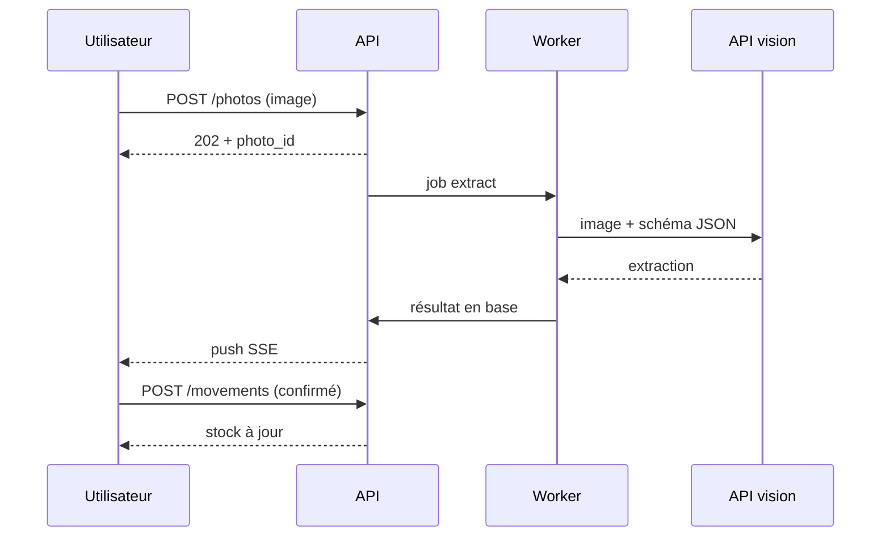
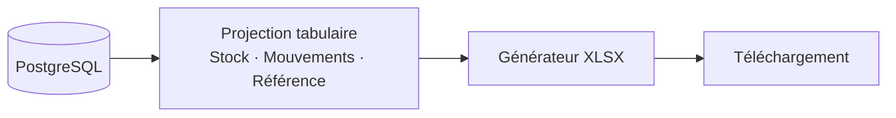

# Cave à vin — Cahier des charges

2026-09-19 · @Franck

## Contexte et objectifs

L'objectif est de tenir un stock de cave juste, sans saisie manuelle : une photo à l'achat crédite le stock, une photo au moment de boire le débite, et un classeur Excel exportable donne à tout moment l'état complet de la cave.

Deux gestes couvrent 95 % de l'usage :

1. **Entrée** — un carton de 6, 12 ou 18 arrive. Photo du carton ou d'une bouteille, choix de la quantité en un tap, la fiche vin est créée ou incrémentée.
2. **Sortie** — une bouteille est prise dans la cave. Photo de l'étiquette, l'application retrouve la référence et décrémente d'une unité.

Trois objectifs de qualité encadrent le projet :

- **Zéro saisie clavier en régime normal.** Toute information (domaine, appellation, millésime, couleur, apogée) est déduite de la photo ou d'un référentiel, jamais tapée. La saisie manuelle reste un mode de rattrapage.
- **Pas d'écriture silencieuse.** Un mouvement de stock n'est jamais écrit sans confirmation à l'écran. Un débit erroné se détecte des mois plus tard et pollue durablement le stock théorique.
- **Le classeur est une restitution, pas la base.** La vérité vit dans la base de l'application ; l'export en donne une photographie datée, à la demande (voir *Restitution*).

L'application est auto-hébergée en Docker sur le homelab existant, exposée en HTTPS derrière le reverse proxy, et utilisée depuis un téléphone.

## Périmètre fonctionnel

| Fonction | Lot | Commentaire |
| --- | --- | --- |
| Entrée de stock par photo (carton ou bouteille) | 1 | Quantité 1 / 6 / 12 / 18 en un tap |
| Extraction domaine, cuvée, appellation, millésime, couleur, format | 1 | Par modèle de vision |
| Fiche vin dédoublonnée | 1 | Clé de matching normalisée |
| Export Excel téléchargeable | 1 | À la demande, avec filtre optionnel |
| Sortie de stock par photo | 2 | Recherche dans les vins déjà en cave |
| Sortie manuelle depuis la liste | 2 | Filet de sécurité si la photo échoue |
| Estimation de l'apogée | 2 | Fourchette + niveau de confiance |
| Relevé de cote iDealwine | 2 | À la demande, jamais automatique |
| Emplacements (casier, rangée, colonne) | 3 | Optionnel par bouteille |
| Alertes « à boire cette année » | 3 | Notification ou vue dédiée |
| Valorisation du stock, statistiques | 4 | Prix d'achat saisi à l'entrée |
| Notes de dégustation, accords mets-vins | 4 |  |

**Hors périmètre.** Pas de gestion de commandes ou de fournisseurs, pas de cave à vin connectée (sondes de température), pas de partage public de la cave, pas de multi-foyer. L'application est mono-cave et mono-foyer, avec comptes locaux.

**Volumétrie cible.** Environ **4 000 bouteilles** en stock pour **100 à 150 références** distinctes, soit 25 à 40 bouteilles par référence — cohérent avec des achats par caisses de 6, 12 ou 18. Le journal des mouvements atteint quelques milliers de lignes après dix ans d'exploitation, pour un trafic courant de 20 à 40 photos par mois. Ces ordres de grandeur restent très en deçà des limites de PostgreSQL. Le seul vrai pic de charge est la reprise de l'existant, traitée en section *Architecture technique*.

## Parcours utilisateur

**Le point dur du projet : une photo d'étiquette ne dit pas si tu ranges ou si tu bois.** Une même bouteille photographiée peut signifier « j'en rentre 12 » ou « j'en sors 1 ». Aucune heuristique ne tranche de façon fiable (ni la date, ni le fait que le vin soit déjà en stock — on rachète du même vin). Le sens vient donc de l'utilisateur : l'écran d'accueil propose deux boutons pleine largeur, **Rentrer** et **Sortir**, et le mode choisi conditionne tout le reste du parcours.



Les deux parcours convergent sur le même écran de confirmation, qui est le seul endroit où une écriture est validée.

### Entrée de stock

1. Bouton **Rentrer**, l'appareil photo s'ouvre directement.
2. Photo du carton ou d'une bouteille. Le carton est privilégié quand il porte les mentions imprimées : il donne souvent domaine, appellation, millésime et nombre de cols d'un coup.
3. Analyse (2 à 8 s). Un écran d'attente affiche l'image et une barre de progression.
4. **Écran de confirmation** : domaine, cuvée, appellation, millésime, couleur, format, chacun éditable d'un tap. Les champs de confiance faible sont surlignés.
5. Sélecteur de quantité : **1 · 6 · 12 · 18** plus un pavé libre. Si la quantité a été lue sur le carton, elle est pré-sélectionnée.
6. Champs optionnels repliés : prix d'achat unitaire, caviste, emplacement.
7. Validation → un mouvement `IN` de N bouteilles, visible immédiatement dans le stock.

### Sortie de stock

1. Bouton **Sortir**, photo de l'étiquette.
2. L'application cherche d'abord **parmi les vins en stock**, ce qui ramène l'espace de recherche à 100-150 références au lieu de l'univers des vins, et rend le matching bien plus fiable qu'une identification à froid.
3. Trois cas :
  - **Match unique et net** → écran de confirmation avec la fiche, quantité 1 par défaut, bouton *Sortir*.
  - **Plusieurs candidats** → liste de 2 à 4 vignettes (photo de référence + millésime), choix en un tap. Cas fréquent quand plusieurs millésimes du même vin cohabitent : l'année est alors le seul discriminant, et elle est souvent mal lue.
  - **Aucun match** → « Ce vin n'est pas dans la cave ». Propositions : rechercher manuellement, ou rentrer le vin (photo prise sans avoir enregistré l'achat).

4. Validation → mouvement `OUT` de 1, stock décrémenté, sync.

### Modes de rattrapage

- **Sortie par la liste** : parcourir la cave, filtrer, décrémenter sans photo. Indispensable quand la bouteille est déjà ouverte ou l'étiquette abîmée.
- **Correction d'un mouvement** : un historique des 20 derniers mouvements avec annulation en un tap. L'annulation écrit un mouvement inverse, elle ne supprime rien.
- **Inventaire physique** : saisie du stock réel constaté pour une référence. L'écart est écrit comme un mouvement `ADJUST` daté, ce qui garde l'historique cohérent et permet plus tard de mesurer la dérive entre stock théorique et stock réel.
- **Mode hors ligne** : la cave est souvent un sous-sol sans réseau. Les photos sont mises en file locale et envoyées dès que l'application revient au premier plan avec du réseau — voir les contraintes iOS en section Architecture. Un compteur « 3 photos en attente » reste visible tant que la file n'est pas vidée.

## Pipeline de reconnaissance

La reconnaissance est un **enchaînement de quatre étapes**, chacune pouvant échouer proprement et rendre la main à l'utilisateur.



### 1. Normalisation

Redressement, recadrage, conversion en JPEG qualité 85, largeur max 1 600 px, suppression des métadonnées GPS. Objectif : réduire le coût du traitement et la taille du stockage sans perdre la lisibilité de l'étiquette. L'original est conservé, il sert à rejouer une analyse si le prompt évolue.

### 2. Extraction par modèle de vision

Un modèle de vision multimodal traite l'image et renvoie **du JSON strict**, pas du texte libre. C'est le choix structurant : un VLM lit correctement les étiquettes de vin là où un OCR classique échoue (typographies gravées, dorures, textes courbes, contre-étiquettes).

Le schéma de sortie attendu :

```csv
champ,type,obligatoire,exemple
producteur,texte,oui,Domaine Leflaive
cuvee,texte,non,Clavoillon
appellation,texte,oui,Puligny-Montrachet 1er Cru
millesime,entier,non,2019
couleur,enum,oui,blanc
format_cl,entier,oui,75
degre,decimal,non,13.5
pays_region,texte,non,Bourgogne
nb_cols_carton,entier,non,6
confiance_globale,decimal,oui,0.87
```

Règles imposées au modèle :

- Ne jamais inventer un champ absent de l'image : un champ illisible revient `null`, pas deviné.
- Renvoyer un score de confiance **par champ**, pas seulement global. Le millésime est le champ le plus souvent mal lu et le plus coûteux à corriger plus tard.
- Distinguer le nom du producteur du nom de la cuvée, piège classique des étiquettes bourguignonnes et alsaciennes.
- Sur une photo de carton, lire le nombre de cols s'il est imprimé (« 6 bouteilles », « caisse de 12 »).

L'appel se fait vers une API cloud au lot 1, exactement comme décidé pour le projet d'inventaire alimentaire. Un modèle local (Qwen-VL, InternVL) reste possible plus tard, mais la qualité de lecture d'étiquette d'un modèle 7 B sur GPU modeste est nettement en dessous ; ce n'est pas le bon endroit pour économiser.

### 3. Consolidation contre un référentiel

La sortie brute du modèle est ensuite **recalée sur un référentiel d'appellations** maintenu en base, seule façon d'obtenir des libellés cohérents d'une photo à l'autre. Sans cette étape, « Chateauneuf du Pape », « Châteauneuf-du-Pape » et « CDP » créent trois références distinctes.

Le référentiel minimal, chargé au déploiement : les ~360 AOC françaises avec région, couleurs autorisées, potentiel de garde indicatif. Une source ouverte suffit (données INAO, reprises dans plusieurs jeux publics). La normalisation applique une recherche floue (trigrammes PostgreSQL, `pg_trgm`) avec seuil : au-dessus de 0,8 on recale silencieusement, entre 0,5 et 0,8 on propose, en dessous on garde le texte brut.

L'enrichissement par une base commerciale (Vivino, Wine-Searcher, LWIN de Liv-ex) est **volontairement hors lot 1** : pas d'API publique gratuite, conditions d'utilisation restrictives, et le gain porte surtout sur les notes et les prix, qui ne sont pas l'objectif.

### 4. Matching et dédoublonnage

Une **référence vin** est identifiée par une clé calculée :

```latex
\text{cle} = \text{norm}(producteur) \; \| \; \text{norm}(cuvee) \; \| \; \text{norm}(appellation) \; \| \; millesime \; \| \; couleur \; \| \; format
```

`norm()` = minuscules, accents retirés, ponctuation supprimée, mots vides du domaine retirés (« domaine », « château », « cuvée »). Deux entrées de clé identique fusionnent ; sinon une nouvelle référence est créée.

En mode **Sortie**, le matching est restreint aux références de stock non nul et combine trois signaux : distance trigramme sur le texte, égalité du millésime, et similarité visuelle entre la photo et la photo de référence stockée à l'entrée. Ce dernier signal est ce qui permet de trancher entre deux millésimes du même domaine quand l'année est illisible.

## Apogée et données œnologiques

**L'apogée n'est presque jamais sur l'étiquette.** Aucune photo ne peut la donner. C'est une donnée dérivée, et le cahier des charges doit l'assumer plutôt que promettre une précision impossible.

Trois sources possibles, par ordre de fiabilité décroissante :

| Source | Fiabilité | Disponibilité | Retenue |
| --- | --- | --- | --- |
| Fiche producteur / critique | Haute | Rare, non structurée | Non |
| Base commerciale (Vivino, Cellar Tracker) | Moyenne | API fermée ou payante | Non au lot 1 |
| Règles par appellation + millésime | Moyenne | Totale, hors ligne | **Oui** |

Le lot 2 implémente donc une **estimation par règles**, stockée en base et modifiable à la main. La formule :

```latex
\text{apogee} = [\, millesime + g_{min} \times f_{m} \;,\; millesime + g_{max} \times f_{m} \,]
```

où `g_min` et `g_max` sont le potentiel de garde de l'appellation et de la couleur, et `f_m` un facteur de qualité du millésime pour la région (0,85 pour un millésime faible, 1,0 pour un millésime moyen, 1,2 pour un grand millésime).

Quelques valeurs de la table de garde, à charger au déploiement et à ajuster :

| Type de vin | Garde min (ans) | Garde max (ans) |
| --- | --- | --- |
| Bourgogne blanc village | 3 | 8 |
| Bourgogne blanc 1er cru | 5 | 15 |
| Bordeaux rouge cru classé | 8 | 25 |
| Bordeaux rouge générique | 3 | 8 |
| Côtes-du-Rhône méridional | 2 | 6 |
| Châteauneuf-du-Pape | 8 | 20 |
| Champagne millésimé | 5 | 15 |
| Alsace vendanges tardives | 10 | 30 |
| Rosé de Provence | 1 | 3 |

Chaque fiche vin affiche donc une **fourchette** (« à boire entre 2027 et 2034 ») accompagnée d'un indicateur de confiance, jamais une année unique. La fourchette est éditable : dès que tu corriges une apogée, la valeur saisie prime définitivement sur la règle.

Le lot 3 exploite cette donnée : une vue « à boire cette année » listant les bouteilles dont la borne haute approche, et une alerte pour les vins dont l'apogée est dépassée.

## Prix de marché et valorisation

**Le prix moyen constaté est un relevé daté, pas un attribut du vin.** Il bouge, parfois beaucoup sur un millésime recherché. Il est donc stocké dans une table `price_quote` en ajout seul, jamais écrasé : la cave a une valeur *au 19 septembre 2026*, et l'historique permet de suivre l'évolution du patrimoine sans travail supplémentaire.

**Le relevé n'est jamais automatique.** Aucun cron, aucune campagne de fond, et aucun relevé déclenché par un export : le classeur reprend les cotes déjà présentes en base, il n'en provoque jamais de nouvelles.

### Source retenue : la cote iDealwine

**Pour une cave française, la cote iDealwine est la meilleure source disponible.** Elle repose sur les adjudications réelles des ventes aux enchères publiques françaises, [est mise à jour chaque semaine et reste gratuite pour tout internaute inscrit](https://www.idealwine.com/fr/aide/faq). Contrairement à un prix marchand affiché, elle reflète ce qu'un acheteur a effectivement payé.

Trois nuances à intégrer dès la conception :

- **La cote inclut les frais acheteur.** Elle correspond au prix au marteau augmenté des frais prélevés par le commissaire-priseur, de l'ordre de 16 %. Pour une valeur de revente, il faut les retrancher. On stocke donc la cote telle quelle et on affiche à côté une valeur de cession estimée, en indiquant clairement le retraitement.
- **La fiabilité dépend de la liquidité du vin.** Un cru classé avec deux cents adjudications annuelles a une cote solide ; un vin confidentiel à trois transactions ne donne qu'un ordre de grandeur. Le nombre de transactions est donc relevé et affiché à côté du prix, jamais masqué.
- **La couverture est partielle.** Les vins qui ne passent pas en salle des ventes ne sont pas cotés. Sur une cave de 4 000 bouteilles, une part des références courantes n'aura simplement pas de cote — elles restent sans prix, conformément à la règle « aucun prix inventé ».

### Faut-il un LLM ? Non, sauf exception

La page de cote est structurée : une requête de recherche puis une lecture par sélecteurs CSS suffisent à récupérer la cote moyenne, la dernière adjudication, la tendance et le nombre de transactions. **Zéro token consommé sur le chemin nominal.**

Le LLM n'intervient que dans un cas : quand la recherche renvoie zéro ou plusieurs candidats et qu'il faut décider lequel correspond à la fiche — homonymies de cuvées, mentions « Vieilles Vignes », producteurs portant le même patronyme. L'appel est alors déclenché explicitement depuis l'écran de désambiguïsation, jamais en tâche de fond.

Quatre contraintes à assumer :

- **Compte requis.** La consultation de la cote suppose d'être inscrit ; le scraper maintient une session authentifiée, avec identifiants montés en secret Docker.
- **Politesse.** Une requête par seconde au maximum, cache agressif, pas de parallélisation. Le volume reste de toute façon dérisoire.
- **Échec propre.** Si la structure de la page change, le parseur doit renvoyer « prix indisponible » et alerter — jamais un prix mal lu. Un prix faux est bien pire qu'un prix absent.
- **Conditions d'utilisation.** L'usage est strictement personnel et non redistribué. À vérifier dans les CGU avant de coder, et à garder derrière l'interface `PriceProvider` : si la voie se ferme, on bascule d'adaptateur sans toucher au reste.

### Déclenchement à la demande

| Déclencheur | Portée | Requêtes |
| --- | --- | --- |
| Bouton *Coter ce vin* sur la fiche | 1 référence | 1 |
| Action *Mettre à jour les prix* sur une sélection | Les références cochées | 1 par référence, avec récapitulatif avant lancement |
| Création d'une référence | Aucune | 0 |
| Synchronisation Sheets ou Excel | Aucune | 0 |

Trois règles encadrent la consommation :

- **Cache de douze mois.** Une cote déjà relevée dans l'année s'affiche depuis la base sans nouvelle requête ; le bouton propose alors *forcer le rafraîchissement*, qui reste un geste volontaire.
- **Plafond mensuel configurable**, bloquant, avec un compteur visible dans l'écran de paramètres.
- **Âge toujours affiché.** « Cote de mars 2026, il y a six mois » — une cote sans date n'a aucune valeur d'information.

### Ce qui est stocké et affiché

Chaque relevé conserve le prix moyen, la fourchette min-max, la devise, la date et **l'URL des offres ayant servi au calcul**. Sans ces liens, un prix affiché n'est pas vérifiable et devient invérifiable dès qu'il paraît surprenant.

Trois garde-fous :

- **Aucun prix inventé.** Un vin non trouvé reste sans prix. Un `null` explicite vaut mieux qu'une estimation par appellation, qui donnerait une valorisation fausse avec l'apparence du sérieux.
- **Le format compte.** Les prix de référence portent sur la bouteille de 75 cl. Magnums et demi-bouteilles ne sont pas convertis automatiquement : le relevé est simplement marqué non applicable.
- **Affichage arrondi et daté.** « ~42 € (relevé du 12/06/2026) », jamais « 41,87 € ». La fausse précision est le meilleur moyen de faire perdre confiance dans le chiffre.

### Valorisation de la cave

```latex
\text{valeur} = \sum_{w} \bigl( \text{stock}(w) \times \text{prix\_moyen}(w) \bigr)
```

La fiche vin et les deux sorties affichent, à côté de la valeur de marché, le **prix d'achat** quand il a été saisi, et l'écart entre les deux. C'est la donnée la plus parlante d'une cave constituée sur la durée, et elle ne coûte rien de plus une fois les deux prix présents.

Les références sans relevé sont comptées à part et affichées comme telles : « valeur estimée sur 138 des 150 références ».

## Modèle de données

Deux partis pris structurent le schéma.

**1. La référence n'est pas la bouteille.** `wine` décrit un vin (domaine, appellation, millésime) ; le stock est une quantité attachée à cette référence. Confondre les deux oblige à créer 18 lignes quand un carton arrive.

**2. Le stock n'est pas un compteur, c'est un journal.** Aucune colonne `quantite` mutable. Le stock est la somme des mouvements :

```latex
\text{stock}(w) = \sum_{m \in \text{movements}(w)} m.delta
```

Ce choix coûte une vue matérialisée et apporte trois choses que le compteur ne donne pas : l'historique complet (« quand ai-je bu ce Chablis ? »), l'annulation sûre d'une erreur, et la capacité à reconstruire le Sheet à l'identique après n'importe quel incident.

### Tables principales

| Table | Rôle | Colonnes clés |
| --- | --- | --- |
| `wine` | Référence vin dédoublonnée | `match_key` (unique), producteur, cuvée, appellation_id, millésime, couleur, format_cl, apogée_min, apogée_max, apogée_source, `idealwine_ref` |
| `movement` | Journal append-only | `wine_id`, `delta` (+6, −1), `type` (IN/OUT/ADJUST), `occurred_at`, `photo_id`, `price_unit`, `note` |
| `price_quote` | Relevés de cote, append-only, à la demande | `wine_id`, `source`, `cote`, `last_hammer`, `n_transactions`, `trend`, `currency`, `quoted_at`, `source_url` |
| `photo` | Image + résultat brut | chemin objet, hash, `raw_extraction` (JSONB), `model`, `latency_ms`, `cost_cents` |
| `app_user` | Compte, identifié par Google | `google_sub` (unique), email, display_name, `is_break_glass` |
| `allowed_email` | Liste blanche d'accès | email, ajouté_par, ajouté_le |
| `export_log` | Trace des exports générés | `user_id`, `generated_at`, `filter`, `row_count` |
| `appellation` | Référentiel INAO | nom canonique, région, couleurs, garde_min, garde_max |
| `vintage_rating` | Qualité du millésime par région | région, année, facteur |
| `location` | Emplacement en cave (lot 3) | casier, rangée, colonne |

### Règles d'intégrité

- `movement.delta` ne peut pas être nul ; un `OUT` est toujours négatif, un `IN` toujours positif.
- Le stock d'une référence peut passer à zéro mais **jamais en négatif** : contrainte vérifiée par trigger avant insertion, avec message explicite côté application (« il ne reste aucune bouteille de ce vin »).
- `photo.raw_extraction` conserve la sortie JSON brute du modèle, telle quelle. C'est ce qui permet de rejouer l'extraction sur tout l'historique le jour où le prompt ou le modèle change, sans reprendre les photos.
- Une vue matérialisée `stock_courant` (wine_id, quantité, valeur, apogée) est rafraîchie à chaque mouvement. À cette volumétrie, le coût est négligeable et la lecture devient triviale pour l'API comme pour la sync.

## Architecture technique

**Principe directeur : tout ce qui est lent ou faillible est asynchrone.** L'appel au modèle de vision prend plusieurs secondes et peut échouer ; le relevé de cote dépend d'un site externe. Ni l'un ni l'autre ne doit bloquer une requête HTTP ni faire perdre une photo. D'où une file de travaux entre l'API et ces dépendances. L'export Excel, lui, est synchrone : il ne dépend que de la base et se génère en quelques secondes.



### Composants

| Service | Technologie | Rôle |
| --- | --- | --- |
| `web` | React + Vite, PWA | Caméra, file hors ligne, écrans de confirmation |
| `api` | NestJS / TypeScript | REST, auth, règles métier, écriture des mouvements, génération du classeur |
| `worker` | NestJS + BullMQ | Extraction vision, consolidation, relevés de cote à la demande |
| `db` | PostgreSQL 16 + `pg_trgm` | Données, recherche floue |
| `queue` | Redis 7 | File de travaux, verrous |
| `storage` | Volume local ou MinIO | Photos originales et normalisées |

La stack TypeScript/NestJS reprend le choix déjà arrêté pour le projet d'inventaire alimentaire : deux applications qui partagent la même structure, les mêmes outils et les mêmes réflexes de déploiement, ce qui divise le coût de maintenance.

### Front : PWA installable, Android et iOS

**Choix confirmé : une PWA unique, installée sur l'écran d'accueil, sans passage par les stores.** Un seul code, aucune revue Apple, aucun certificat de signature, et une mise à jour qui se propage au rechargement. Pour un usage familial sur deux ou trois téléphones, le détour par l'App Store et le Play Store n'apporte rien et coûte cher (99 $/an côté Apple, délais de revue à chaque correctif).

L'installation se fait par *Partager → Sur l'écran d'accueil* sur iOS et par la bannière d'installation sur Android. Depuis iOS 26, un site ajouté à l'écran d'accueil s'ouvre par défaut en mode application autonome, ce qui supprime la principale confusion historique côté iPhone.

| Capacité nécessaire | Android (Chrome) | iOS (Safari/WebKit) |
| --- | --- | --- |
| Installation sur l'écran d'accueil | Oui, avec invite automatique | Oui, geste manuel |
| Accès caméra (`getUserMedia`) | Oui | Oui |
| Capture par appareil photo natif (`input capture`) | Oui | Oui |
| Cache hors ligne (service worker) | Oui | Oui |
| File locale IndexedDB | Oui | Oui, quota plus serré |
| Background Sync API | Oui | **Non** |
| Notifications push | Oui | Depuis iOS 16.4, app installée seulement |

La seule case rouge est le Background Sync, absent de WebKit et [toujours pas à l'ordre du jour](https://blog.codercops.com/blog/progressive-web-apps-2026) ; c'est la limite iOS qui a le plus d'effet sur ce projet. Le blocage des web apps installées en Europe, annoncé par Apple début 2024 au titre du DMA, a été [annulé avant la sortie d'iOS 17.4](https://techcrunch.com/2024/03/01/apple-reverses-decision-about-blocking-web-apps-on-iphones-in-the-eu/) : ce n'est plus un risque.

**Trois conséquences de conception :**

1. **La prise de vue passe par l'appareil photo natif**, via `<input type="file" accept="image/*" capture="environment">`, et non par un viseur maison en `getUserMedia`. Le comportement est identique sur les deux plateformes, et on récupère gratuitement l'autofocus, le flash, le HDR et la stabilisation — décisifs sur une étiquette gravée ou dorée photographiée dans une cave mal éclairée. Un viseur personnalisé avec cadre de visée reste un raffinement possible au lot 3.
2. **La file hors ligne se vide au premier plan, jamais en arrière-plan.** Sans Background Sync sur iOS, la règle est : envoi à l'ouverture de l'application, sur l'événement `online`, et par relance périodique tant que l'application est ouverte. Android suivrait exactement le même chemin de code — on ne maintient pas deux stratégies. Corollaire à assumer : une photo prise hors ligne à la cave part quand l'application est rouverte avec du réseau, pas avant. Le compteur « photos en attente » doit donc être visible en permanence, pas caché dans un menu.
3. **Les alertes d'apogée du lot 3 ne reposent pas sur le web push.** Une notification Home Assistant, déjà en place sur le homelab, ou un simple e-mail hebdomadaire, sont plus fiables et plus faciles à régler qu'un push web soumis aux règles WebKit.

Deux points d'hygiène : la file locale est plafonnée (20 photos ou 50 Mo, compression avant mise en file) pour rester sous le quota iOS, et un écran de premier lancement explique l'ajout à l'écran d'accueil, puisque iOS ne propose aucune invite automatique.

**Porte de sortie.** Si une limite bloquante apparaît plus tard, le même code React s'emballe dans Capacitor pour produire une coque native Android et iOS sans réécriture. Cette option n'est pas ouverte au lot 1 : elle réintroduit précisément les contraintes de store que la PWA évite.

### Flux d'une entrée de stock



Le client poste la photo et reçoit immédiatement un identifiant ; le résultat arrive par SSE quand il est prêt. Si l'utilisateur ferme l'application entre-temps, le résultat l'attend dans une corbeille « à confirmer ».

### Idempotence

Chaque photo porte un hash de contenu, chaque mouvement une clé d'idempotence générée par le client. Une double soumission — réseau instable, double tap, rejeu de la file hors ligne — ne crée jamais deux mouvements. C'est la protection la plus importante du système : dans un scénario hors ligne, le rejeu est la règle, pas l'exception.

### Charge et reprise de l'existant

**En régime courant, 4 000 bouteilles ne sollicitent rien.** Le stock vit dans 100 à 150 lignes de `wine` et quelques milliers de lignes de `movement` ; la base pèse moins de 100 Mo hors photos, chaque requête se résout en quelques millisecondes sur un index, et la vue matérialisée `stock_courant` se rafraîchit en moins d'une seconde. Aucun composant de l'architecture n'est dimensionné par ce volume — ce serait encore vrai à 40 000 bouteilles.

La charge réelle se concentre sur trois points, tous liés à des rafales et non au volume stocké :

| Point de charge | Sollicitation | Traitement |
| --- | --- | --- |
| Reprise de l'existant | 100-150 photos en une ou deux sessions | Mode campagne + traitement en file |
| Entrée d'un carton de 18 | 18 mouvements en quelques secondes | Transaction unique |
| Génération du classeur | 150 lignes de stock, quelques milliers de mouvements | Quelques secondes, en synchrone |
| Recherche visuelle en sortie | Comparaison à 150 photos de référence | Négligeable ; `pgvector` seulement si le nombre de références décuple |

### Mode campagne d'inventaire

La reprise des 4 000 bouteilles déjà en cave est le seul moment où le système est vraiment poussé. Elle justifie un **mode campagne** au lot 1, distinct du parcours d'entrée unitaire :

- **Prise de vue en rafale, sans attente.** Photo, quantité, suivant. Aucune confirmation à l'unité : les photos partent dans la file et l'analyse se fait en arrière-plan.
- **Revue groupée.** Un écran unique liste les fiches extraites, en signalant d'abord celles à faible confiance. On valide en masse et on ne corrige que les écarts. Enchaîner 150 écrans de confirmation individuels rendrait la reprise décourageante, et c'est la principale cause d'abandon de ce type d'outil.
- **Concurrence maîtrisée.** Le worker traite 4 à 6 photos en parallèle, avec back-off si l'API de vision renvoie un code 429. À ce rythme, 150 photos sont analysées en 5 à 10 minutes.
- **Coût de la reprise** : 150 appels au modèle, soit 1,50 à 3 € une seule fois. Non bloquant.
- **Reprise interruptible** : une campagne se met en pause et se reprend. Personne ne photographie 150 références d'affilée.

**Une cave de 4 000 bouteilles est rarement sans inventaire papier ou tableur.** Si une liste existe déjà, un **import CSV** devient la voie de reprise prioritaire, et la photo ne sert plus qu'à compléter les fiches et à constituer les images de référence nécessaires au matching en sortie. Cet import est bien moins coûteux à développer qu'un mode campagne robuste.

### Stockage des images

À raison d'une photo de référence par vin et d'une photo par mouvement, le volume croît de 60 à 100 Mo par an à ce rythme d'usage. Les 40 Go prévus pour la VM couvrent largement dix ans d'exploitation, sauvegardes locales incluses.

## Charte graphique et interface

Le jeu de tokens **Cave & Terroir — Bastide Provençale & Travertin Doré** fait référence unique pour toute l'interface. Il suit le format W3C Design Tokens, donc il se consomme directement : une étape de build (Style Dictionary ou équivalent) génère les variables CSS à partir du fichier, versionné dans le dépôt. **Aucune valeur de couleur, d'espacement ou de rayon n'est écrite en dur dans un composant.**

### Ce que la charte apporte

- **Une sémantique déjà alignée sur la spec.** Le doré chêne est désigné comme l'action d'entrée en cave, la ferronnerie noire comme l'action de sortie et de validation : c'est exactement le couple *Rentrer* / *Sortir* de l'écran d'accueil. Cette correspondance doit tenir sans exception, y compris dans les écrans secondaires — c'est ce qui rendra le geste automatique.
- **Les couleurs de vin** (bordeaux, or paille, pêche cuivrée, alvéole vide) couvrent directement le plan de cave du lot 3.
- **Les statuts** correspondent aux états déjà prévus : file hors ligne et apogée proche en `warning`, conflit de synchronisation en `error`, stock vérifié en `success`.
- **Les specs mobiles sont posées** : cible tactile de 48 px, en-tête de 56, barre basse de 64, et un `safeBottom` bâti sur `env(safe-area-inset-bottom)` — cohérent avec les contraintes iOS de la section précédente.

### Corrections appliquées en v1.1

1. **Fond de bouton primaire accessible.** Le doré `#A37943` reste pour les badges, pastilles et aplats sans texte ; un token `primary.action` à `#8B612C` porte désormais les boutons texte, à environ 5,5:1 en blanc. Le survol descend à `#6B491D`.
2. **Mode cave.** Un groupe `colorDark` complet reprend tous les rôles sémantiques en valeurs sombres, émis sous `[data-theme="cave"]` et sous `prefers-color-scheme: dark`. Le bouton *Sortir* y devient pierre claire : l'opposition visuelle entre les deux gestes est conservée par inversion, pas par hasard.
3. **Alvéoles tapables.** `wineCellSize` reste à 28 px pour le dessin, `wineCellTouchTarget` ajoute une zone de touche de 48 px via pseudo-élément. Le plan de cave garde sa densité sans devenir impraticable au doigt.
4. **Garde-fous de lisibilité inscrits dans les tokens.** Les descriptions de `text.muted`, `fontSize.xs` et `status.warning` portent désormais leur restriction d'usage : pas de donnée utile en 11 px atténué, et le orange d'avertissement en aplat seulement.
5. **Polices auto-hébergées** mentionnées dans les tokens de famille, pour que la contrainte suive la charte et ne se perde pas en cours de route.

La v1.1 ajoute par ailleurs ce qui manquait : tokens de mouvement (quatre durées, trois courbes), échelle `zIndex`, anneau de focus clavier — dans les deux thèmes — et `safeTop` en pendant de `safeBottom`.

### Application aux écrans

| Élément | Traitement |
| --- | --- |
| Domaines, cuvées, appellations | Serif, `text.primary` |
| Chiffres, cotes, quantités, formulaires | Sans, jamais en serif — les chiffres elzéviriens de Cormorant s'alignent mal en colonne |
| Boutons *Rentrer* / *Sortir* | Pleine largeur, hauteur ≥ 56 px, doré et ferronnerie |
| Carte de confirmation | `container.lowest`, bordure `outline.variant`, champs à faible confiance sur `warning` |
| Listes et tableaux de stock | Fond `surface.base`, séparateurs `outline.subtle` |

### Ce que la charte ne couvre pas encore

Reste à produire : le jeu d'icônes, et les illustrations d'état vide. La profondeur (`z-index`) et le focus clavier sont désormais couverts, ce dernier comptant surtout pour la revue groupée du mode campagne, qui se fera plus volontiers au clavier sur grand écran qu'au doigt.

## Restitution : export Excel

**Une seule sortie : un classeur `.xlsx` que l'utilisateur télécharge quand il le veut.** Plus de Google Sheets, plus de Drive, plus de synchronisation continue. L'état de la cave vit dans PostgreSQL, et l'export en est une photographie à un instant donné.

C'est un retrait par rapport à l'intention initiale — un classeur en ligne tenu à jour en permanence — et la contrepartie mérite d'être nommée : on perd la consultation à distance sans ouvrir l'application, on gagne la disparition complète d'une dépendance externe. Disparaissent avec elle le compte de service, les scopes Drive, les jetons de rafraîchissement, les quotas d'API et l'obligation de publier l'application en production. La projection tabulaire, elle, ne bouge pas : rebrancher une sortie en ligne plus tard reste un adaptateur à écrire, pas une refonte.



### Contenu du classeur

Trois feuilles, toutes générées :

| Feuille | Contenu |
| --- | --- |
| `Stock` | Une ligne par référence en stock : domaine, cuvée, appellation, millésime, couleur, format, quantité, apogée min/max, cote, date de relevé, valeur |
| `Mouvements` | Journal complet, une ligne par mouvement, la plus récente en haut |
| `Référence` | Appellations, régions, potentiels de garde — matière à formules et tableaux croisés |

Le fichier est produit avec ExcelJS côté worker, avec la mise en forme qu'un tableur mérite : colonnes dimensionnées, volets figés, tableaux structurés, et mise en forme conditionnelle sur les apogées dépassées.

### Déclenchement

- **Bouton *Exporter*** dans l'application. Génération en quelques secondes, téléchargement direct sur le téléphone ou le poste.
- **Filtre optionnel avant export** : toute la cave, ou une couleur, une région, les vins à boire cette année. C'est ce qui rend l'export utile au quotidien plutôt qu'une fois l'an.
- **Aucun export planifié, aucune écriture automatique.** Si une archive régulière devient souhaitable, une tâche nocturne déposant le fichier sur le NAS (VM 101) s'ajoutera sans rien changer d'autre.

Le classeur est **régénéré intégralement** à chaque export : pas de fusion, pas de conflit, aucun état à maintenir entre deux générations. Un fichier téléchargé est daté et figé — le modifier n'a aucun effet sur la cave, et la version suivante s'obtient en réexportant.

## Déploiement et exploitation

### Cible d'hébergement

L'application tourne en Docker Compose sur le Proxmox existant, dans une VM ou un LXC dédié (2 vCPU, 4 Go de RAM, 40 Go de disque suffisent largement). L'exposition passe par le nginx proxy manager déjà en place sur la VM 102 : un sous-domaine, un certificat Let's Encrypt, et le conteneur `web` en amont. Rien à ouvrir de plus sur la box.

### Services Compose

| Conteneur | Image | Volumes / notes |
| --- | --- | --- |
| `web` | build local (nginx + assets) | Port unique exposé au proxy |
| `api` | build local Node 22 | Secrets en variables d'environnement |
| `worker` | même image que `api`, commande différente | Une seule réplique suffit |
| `db` | `postgres:16-alpine` | Volume `pgdata`, `pg_trgm` activée à l'init |
| `redis` | `redis:7-alpine` | Persistance AOF |
| `minio` | `minio/minio` (optionnel) | Un volume local suffit au lot 1 |

### Secrets

Trois secrets seulement : la clé de l'API de vision, le couple identifiant / secret du client OAuth Google, et le secret de signature des sessions. Fichiers montés en lecture seule, jamais dans l'image, jamais dans le dépôt Git.

### Sauvegardes

- `pg_dump` quotidien compressé, poussé vers un partage du NAS Synology virtualisé (VM 101), rétention 30 jours.
- Photos synchronisées vers le même partage, hebdomadaire. Le volume reste modeste : environ 200 Ko par photo normalisée, soit moins de 2 Go pour 10 000 photos.
- **Test de restauration trimestriel**, à noter dans la procédure. Une sauvegarde jamais restaurée n'est pas une sauvegarde.

### Sécurité

- Authentification par compte Google, détaillée ci-dessous ; un unique compte local de secours conserve un mot de passe haché en argon2. Sessions en cookie `HttpOnly` `Secure` `SameSite=Lax`.
- Aucune donnée sensible : l'intérêt d'un attaquant sur un inventaire de cave est faible, mais l'exposition publique du sous-domaine justifie l'authentification et un rate limit sur l'endpoint de photo (coût des appels au modèle).
- Les coordonnées GPS des photos sont supprimées à la normalisation.

### Authentification par compte Google

**Connexion par « Se connecter avec Google », sans mot de passe à choisir ni à retenir.** L'application implémente OpenID Connect et ne demande que trois scopes : `openid`, `userinfo.email`, `userinfo.profile`.

Ce périmètre n'est pas cosmétique : Google exempte les autorisations limitées au nom, à l'adresse e-mail et au profil de [la liste d'utilisateurs de test, de l'écran d'avertissement et de l'expiration au bout de sept jours](https://support.google.com/cloud/answer/15549945?hl=en). La connexion elle-même échappe donc à toute formalité.

**Règle ferme : aucun autre scope ne sera jamais demandé à ce client.** L'export étant un simple téléchargement, l'application n'a besoin d'aucun accès à Drive, à Sheets ni à quoi que ce soit d'autre du compte Google. Tant que le périmètre reste l'identité seule, l'exemption tient : pas de procédure de vérification, pas d'écran de consentement à publier, pas de réautorisation hebdomadaire. Le jour où une sortie en ligne reviendrait au programme, c'est ce paragraphe qu'il faudrait rouvrir en premier, et `drive.file` — non sensible — serait le seul scope à envisager.

| Aspect | Décision |
| --- | --- |
| Scopes | `openid`, `userinfo.email`, `userinfo.profile`, et rien d'autre |
| Identifiant stable | Le `sub` Google, jamais l'adresse e-mail, qui peut changer |
| Contrôle d'accès | Table `allowed_email` ; une adresse hors liste est refusée, sans création de compte |
| Session | Cookie serveur signé ; aucun jeton Google côté navigateur, aucun jeton de rafraîchissement à conserver |
| Compte de secours | Un compte local unique, mot de passe argon2, si Google est injoignable |
| Redirection | URI fixe sur le sous-domaine, en HTTPS |
| Statut de publication | Aucune démarche : l'exemption des scopes de base suffit |

La liste blanche est le point de sécurité déterminant : le sous-domaine est exposé publiquement, donc sans elle **n'importe quel titulaire d'un compte Google pourrait se créer un accès à la cave**. Avec elle, la surface se réduit aux deux ou trois adresses du foyer, et l'ajout d'un membre se fait par une ligne en base.

### Coûts récurrents

Le seul coût variable est l'API de vision : de l'ordre de 0,5 à 2 centimes par photo selon le modèle retenu. À 60 photos par mois, cela reste sous 1,50 € mensuel. Les API Google Sheets et le référentiel INAO sont gratuits. Un plafond mensuel configurable, avec bascule en saisie manuelle au-delà, évite toute surprise.

## Lotissement, exigences et points ouverts

### Lots

| Lot | Contenu | Critère de fin |
| --- | --- | --- |
| 0 | Socle : Compose, PostgreSQL, connexion Google, PWA vide, CI | L'application répond en HTTPS sur le sous-domaine |
| 1 | Entrée par photo, extraction, confirmation, export Excel | Un carton de 12 est rentré en moins de 60 s et figure dans le classeur exporté |
| 2 | Sortie par photo, recherche dans la cave, apogée estimée, cote à la demande | Une bouteille est sortie en moins de 20 s, sans faux débit |
| 3 | Emplacements, vue « à boire », alertes, hors ligne robuste | Une session complète en sous-sol sans réseau se rejoue sans perte |
| 4 | Valorisation au prix de marché, statistiques, notes de dégustation |  |

### Exigences non fonctionnelles

- Entrée complète (photo → Sheet à jour) en moins de 60 secondes pour un carton.
- Extraction en moins de 10 secondes au 90e centile.
- Taux de champs corrigés à la main inférieur à 15 % après le lot 2 — c'est la métrique qui dit si le projet tient sa promesse de zéro saisie. Elle se mesure directement : l'application compare l'extraction brute et la fiche confirmée.
- Aucune perte de photo, même hors ligne : la file locale survit à la fermeture de l'application.
- Restauration complète depuis sauvegarde en moins d'une heure.

### Points à trancher avant de démarrer

- **Construire ou adapter ?** Aucun outil auto-hébergé de gestion de cave ne fait de la reconnaissance photo aujourd'hui ; les solutions existantes (Cellar Tracker, Vivino) sont des SaaS. Confirmer que le développement se justifie — comme pour le choix laissé ouvert avec Grocy sur le projet d'inventaire alimentaire.
- **Existe-t-il déjà une liste de la cave** (tableur, application, inventaire papier) ? À 4 000 bouteilles, c'est probable. Si oui, l'import CSV passe devant le mode campagne pour la reprise, et le lot 1 s'allège nettement.
- **Source du prix de marché** : vérifier les CGU d'iDealwine pour un usage personnel, et mesurer la couverture réelle sur une vingtaine de vins représentatifs de la cave. Si trop de références courantes ressortent sans cote, la question de la source se rouvre.
- **Millésime : confirmation systématique ou seulement en confiance faible ?** C'est le champ le plus mal lu et le plus coûteux à corriger. Un tap de confirmation sur chaque entrée coûte peu et sécurise beaucoup.
- **Colonnes du classeur** : partir de la structure d'un fichier que tu utilises déjà, ou la définir de zéro ? Si un fichier existe, ses colonnes guident la feuille `Stock` et il faut prévoir un import initial.
- **Photos de cartons** : disponibilité réelle des mentions imprimées. À vérifier sur trois ou quatre cartons avant de coder la lecture de `nb_cols_carton`.
- **Prix d'achat** : saisi à l'entrée ou jamais ? Sans lui, pas d'écart achat / marché, qui est la statistique la plus intéressante du lot 4.
- **Modèle de vision** : lequel, et avec quel plafond de dépense mensuel ?
